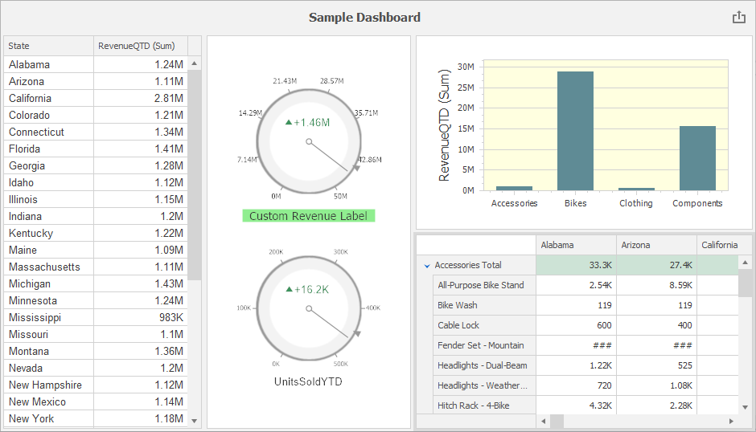

<!-- default badges list -->

<!-- default badges end -->

# Dashboard for WinForms - How to Access the Underlying Controls of the Dashboard Items

This example demonstrates how to customize the controls used to visualize data in the dashboard items at runtime.

The following options are changed:

* [Grid](https://docs.devexpress.com/Dashboard/15150): The **font** is changed to "Arial, 10". For this, handle the [DashboardDesigner.DashboardItemControlUpdated](https://docs.devexpress.com/Dashboard/DevExpress.DashboardWin.DashboardDesigner.DashboardItemControlUpdated) event and access the control's [MainView](https://docs.devexpress.com/WindowsForms/DevExpress.XtraGrid.GridControl.MainView).
* [Chart](https://docs.devexpress.com/Dashboard/14719): The **background color** of the chart pane is set to _LightYellow_. For this, handle the [DashboardDesigner.DashboardItemControlUpdated](https://docs.devexpress.com/Dashboard/DevExpress.DashboardWin.DashboardDesigner.DashboardItemControlUpdated) event and acess the control's [Diagram](https://docs.devexpress.com/WindowsForms/DevExpress.XtraCharts.ChartControl.Diagram) property.
* [Pivot](https://docs.devexpress.com/Dashboard/15266): Cell values related to "Mountain" products are **hidden**, `###` is displayed instead. The [PivotGridControl.CustomCellValue](https://docs.devexpress.com/WindowsForms/DevExpress.XtraPivotGrid.PivotGridControl.CustomCellValue), [DashboardDesigner.DashboardItemControlCreated](https://docs.devexpress.com/Dashboard/DevExpress.DashboardWin.DashboardDesigner.DashboardItemControlCreated) and [DashboardItemBeforeControlDisposed](https://docs.devexpress.com/Dashboard/DevExpress.DashboardWin.DashboardDesigner.DashboardItemBeforeControlDisposed) events are handled to customize the cell values.
* [Gauge](https://docs.devexpress.com/Dashboard/15264): The background color of the first gauge's label is set to "LightGreen", a custom label is set and displayed in "Tahoma, 16" font. The number of major ticks is set to 8. For this, handle the [DashboardDesigner.DashboardItemControlUpdated](https://docs.devexpress.com/Dashboard/DevExpress.DashboardWin.DashboardDesigner.DashboardItemControlUpdated) event and use the [Gauges](https://docs.devexpress.com/WindowsForms/DevExpress.XtraGauges.Win.GaugeControlBase.Gauges) property to access the collection of gauges displayed in the control.

## Files to Review

- [DesignerForm1.cs](./CS/DashboardDesigner_ControlAccess/DesignerForm1.cs) (VB: [DesignerForm1.vb](./VB/DashboardDesigner_ControlAccess/DesignerForm1.vb))

## Documentation

- [Access to Underlying Controls](https://docs.devexpress.com/Dashboard/401095/)

## More Examples

- [ASP.NET Core Dashboard - How to access API of underlying widgets](https://github.com/DevExpress-Examples/asp-net-core-dashboard-underlying-widgets-api)
- [Dashboard for React - How to access API of underlying widgets](https://github.com/DevExpress-Examples/dashboard-react-underlying-widgets-api)
- [ASP.NET MVC Dashboard - How to access API of underlying widgets](https://github.com/DevExpress-Examples/asp-net-mvc-dashboard-underlying-widgets-api)
- [ASP.NET Web Forms Dashboard - How to access API of underlying widgets](https://github.com/DevExpress-Examples/how-to-access-api-of-underlying-widgets-in-the-aspnet-dashboard-control-t492396)
